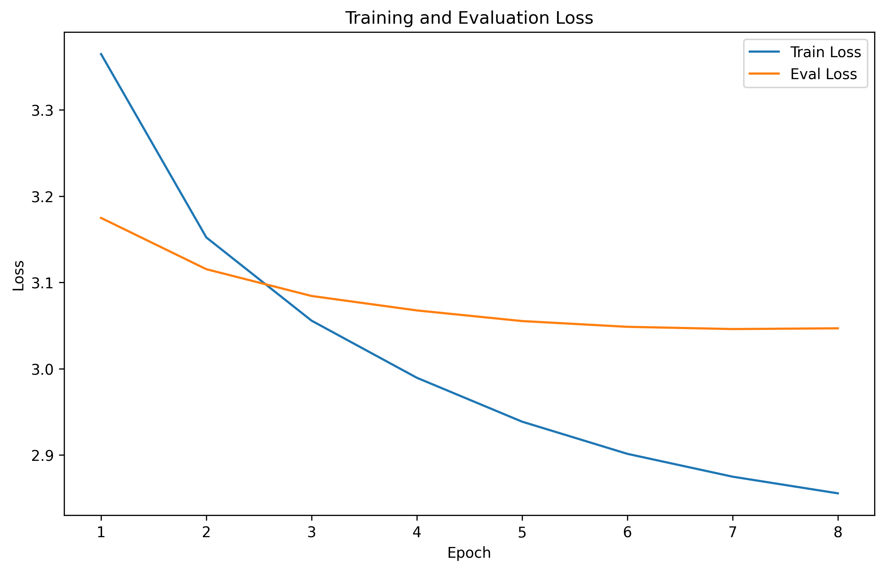
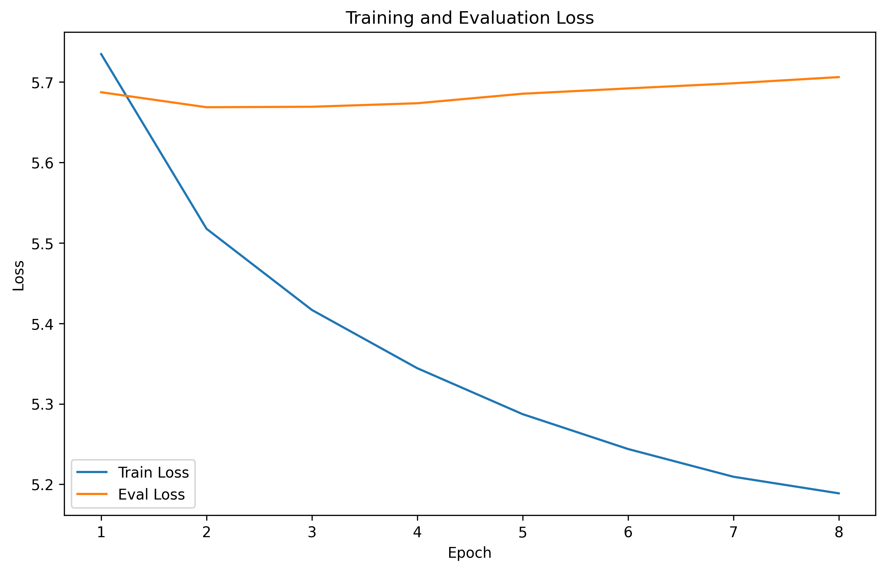
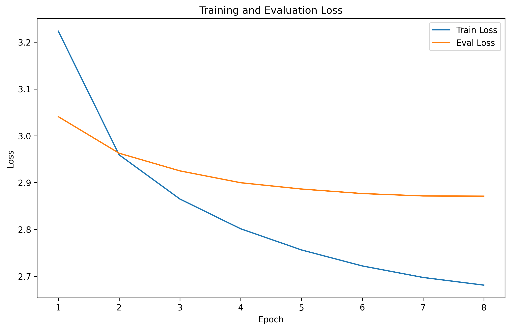
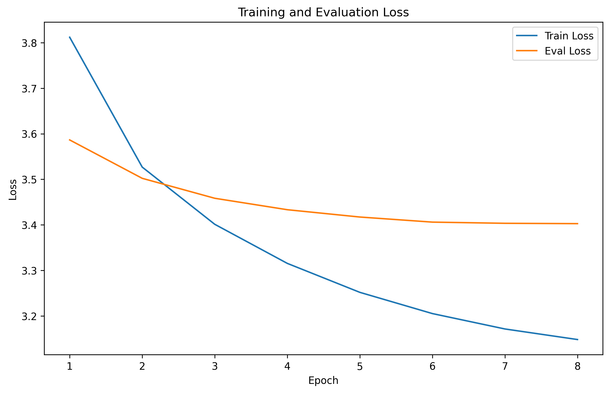

# SPAR Application Take-Home Task

> Topic: Exploring dangerous hidden reasoning capabilities of language models
>
> Mentor: Rohan Subramani
>
> Prompt: Use a Runpod GPU to finetune a huggingface transformer language model of your choice on a dataset of your choice, then evaluate the effect of the finetuning by running some of the same prompts on the pre- and post-finetuning models.

## Overview

This repository fine-tunes DistilGPT-2 on text datasets. The datasets included in this repository are:

1. The *Harry Potter* series, by J.K. Rowling
2. *Finnegans Wake*, by James Joyce
3. Shakespeare's complete works
4. Trump's social media posts (Twitter and Truth Social)

## Usage

1. Clone the repository:
```bash
git clone https://github.com/The-Turtle/SPAR-App.git
```
2. Install dependencies:
```bash
pip install -r requirements.txt
```
3. Run the main script:
```bash
python main.py
```

The script will:
1. Prompt you to select a dataset
2. Train a model on the selected dataset, or load the model if it already exists
3. If training, produce a plot of the training and evaluation losses over epochs
4. Allow interactive text generation with custom prompts

To train on your own dataset, simply follow these steps:
1. Place your text file in the `data/` directory.
2. Run: `python main.py`.
3. Specify the name of your dataset when prompted.

### Training Loss Plots

Below are the training and evaluation loss plots for each dataset:

**Harry Potter** | **Joyce**
---|---
 | 

**Shakespeare** | **Trump**
---|---
 | 

With the exception of Finnegans Wake, all models showed convergence with decreasing training and evaluation losses across epochs. The loss plots are saved in the `plots/` directory.

## Results

### Behavioral Changes Examples
